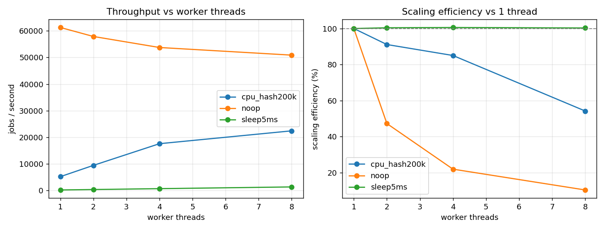
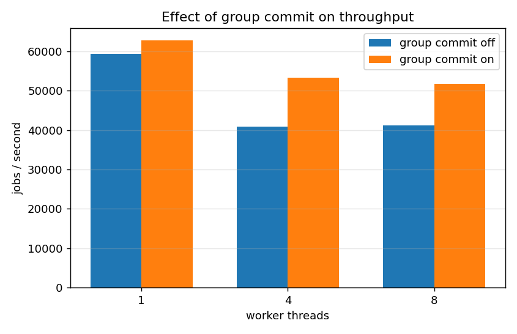
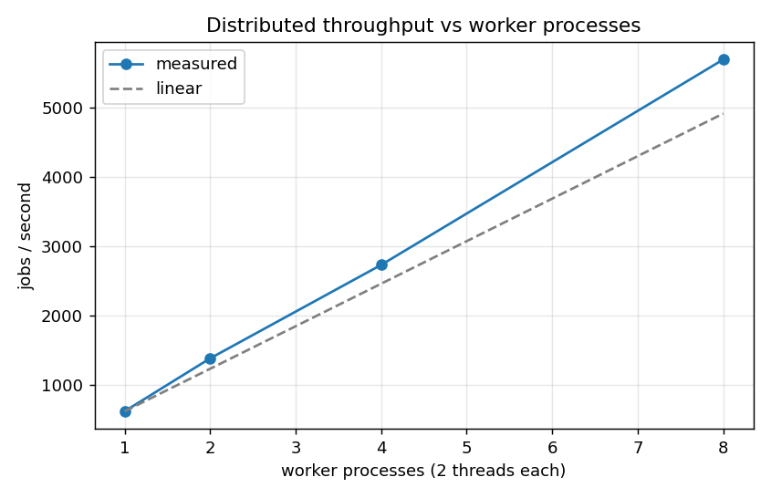
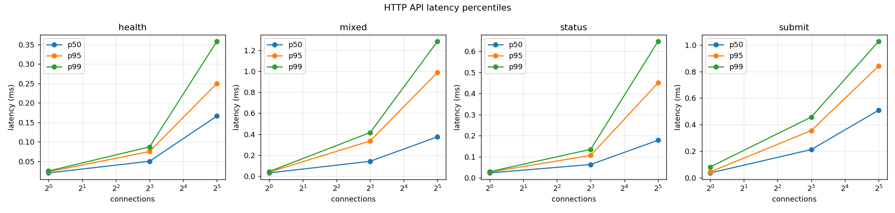
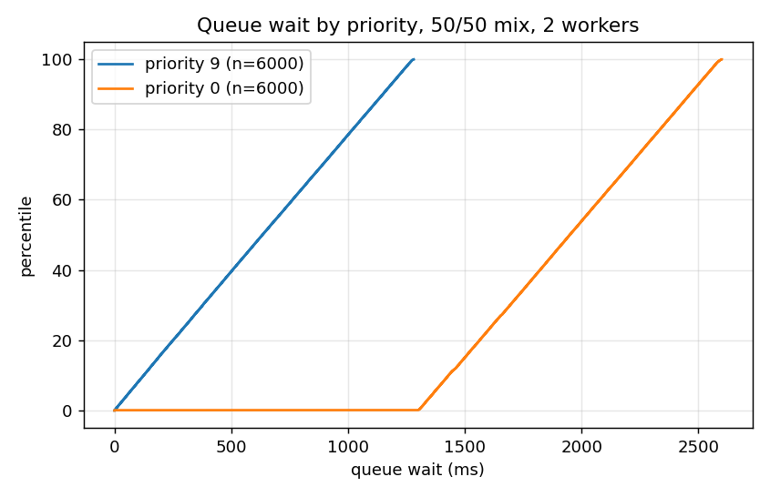
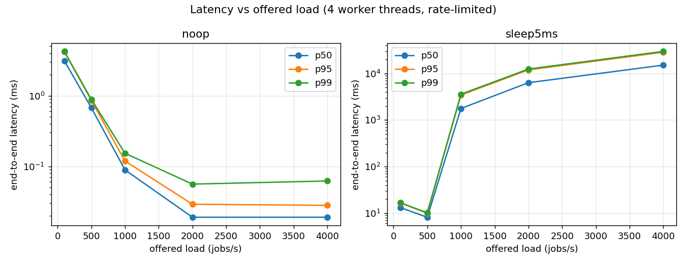
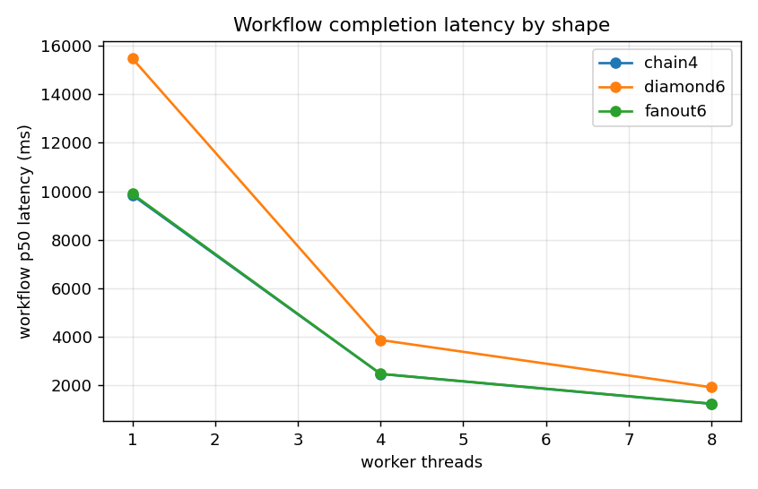
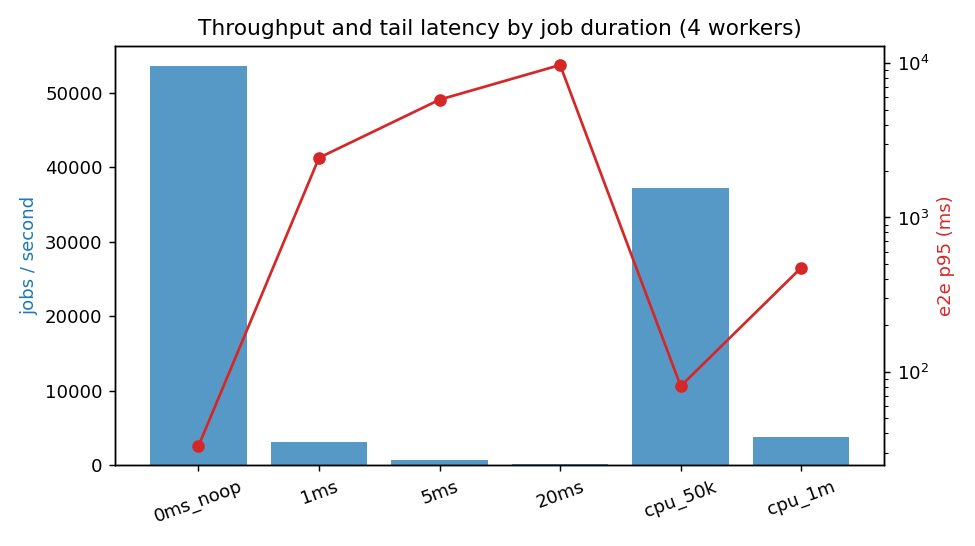

# BENCHMARKS

Everything below is produced by two commands and can be regenerated from scratch:

```bash
node scripts/run_benchmarks.mjs          # runs the matrix, writes results/summary.csv + results/raw/
python3 scripts/analyze_benchmarks.py    # computes the tables and plots, rewrites the section below
```

`scripts/run_benchmarks.mjs --quick` runs a reduced matrix (smaller job counts, one
repetition) for a fast sanity check; the numbers published here come from the full run.

---

## Methodology

**What is measured, and from where.** The benchmark driver writes one CSV row per job (or
per HTTP request) with nanosecond-resolution timestamps into `results/raw/`. Percentiles are
computed offline from those raw samples using the **nearest-rank** method
(`scripts/analyze_benchmarks.py`), which matches `apps/bench_common.hpp` exactly, so an
offline figure and the driver's printed figure are the same statistic. The `/metrics`
endpoint also exposes latency histograms, but those are bucket estimates and **no number
here is taken from them**.

**Two load regimes, reported separately.** This distinction matters more than any single
number:

- *Saturating* runs submit as fast as possible. They measure **throughput**. Their latency
  figures are dominated by backlog depth, so a p95 of many seconds in a saturating run
  means "the queue was long", not "the scheduler is slow". They are still reported, because
  hiding them would make the throughput numbers look free.
- *Rate-limited* runs (`--rate`) give every job an **intended submission time** and measure
  latency from that time rather than from the moment the submit call actually happened.
  This is the standard guard against coordinated omission: a producer that falls behind
  still reports the delay it caused. Latency claims come from these runs.

**Repetitions and spread.** Each configuration runs 3 times. Tables report the **median**
and, where it is informative, the min-max range. A single run would be a claim the next run
could contradict: on this machine the same configuration varied by up to ~2x when the
machine was not idle.

**Environment sensitivity.** These numbers were taken on an otherwise idle machine. Running
a compile or a sanitizer suite alongside the benchmark changed throughput by more than a
factor of two during development, which is why `results/env.txt` records the machine and
why the suite prints a warning about it.

**Definitions used consistently.**

| Term | Meaning here |
|---|---|
| worker thread | an OS thread inside one process that executes jobs |
| worker process | a separate `jobengine-worker` OS process |
| machine | a physical host - **always 1** in every measurement below |
| concurrent jobs | jobs in `RUNNING` at one instant, bounded by total worker slots |
| throughput | jobs reaching a terminal state per second of wall time |
| e2e latency | submit (or intended submit) to the job's completion callback |
| queue wait | the moment a job became *eligible* to the moment a worker started it |

**Workloads.** `noop` returns immediately and therefore measures pure engine overhead.
`sleep{N}` is an **I/O-bound stand-in**: it yields its core the way a blocking I/O call
would, but it performs no real disk or network I/O, so these runs do not measure a storage
device. (A real file-processing handler, `file_lines`, exists and is tested, but a benchmark
of it would mostly measure the page cache, which is not a useful signal here.)
`cpu_hash{N}` is CPU-bound.
`flaky` fails a configurable share of attempts. `fail` fails deterministically.
Workflow runs use `chain` (a linear DAG), `fanout` (one root, N independent children) and
`diamond` (root, parallel middle layer, join).

**CPU and memory.** Each driver reports its own `getrusage` figures for the measured run:
total CPU seconds, mean cores busy (CPU time divided by wall time, so `1.00` means one core
fully occupied), and peak resident set size. These cover the benchmark process itself, which
in the in-process suites *is* the engine.

**What the numbers do not cover.** Only one machine; only localhost networking; an
I/O-bound workload that sleeps rather than touching a disk; SQLite with
`synchronous=NORMAL` in WAL mode (see `docs/DESIGN_DECISIONS.md` D-06); no measurement of
behaviour under memory pressure, disk-full conditions, or a degraded network.

---

## Reading the results

The three results worth understanding before the tables:

1. **Persistence was the bottleneck, not the scheduler.** The first implementation wrote
   every state transition as its own SQLite transaction - four commits per job - and
   throughput *fell* as worker threads were added, because more threads meant more
   contention on one writer. Section 7 is the controlled A/B of the fix (group commit),
   measured by flipping one flag on the same binary and workload.
2. **Strict priority does what it says, and the cost is visible.** Section 3 shows the
   queue wait for each priority class in the same run. High-priority jobs wait less by
   construction; the low-priority class pays for it, which is the documented behaviour of
   strict priority rather than a defect.
3. **Scaling is sublinear and the tables say by how much.** Scaling efficiency is reported
   next to every speedup so that "it scales" is never asserted without its number.

<!-- BEGIN GENERATED: do not edit below this line, run scripts/analyze_benchmarks.py -->

### Environment

```
timestamp_utc=2026-09-11T13:16:55.210Z
os=Darwin 27.0.0 arm64
cpu=Apple M4
logical_cores=10
physical_cores=10
memory_bytes=17179869184
compiler=Apple clang version 21.0.0 (clang-2100.3.33.1)
cmake=cmake version 4.4.3
sqlite=3.51.0
build_type=Release
repetitions_per_configuration=3
quick_mode=false
note=benchmarks should be run on an otherwise idle machine; a concurrent build or
note=heavy background process changes these numbers by more than a factor of two.
```

### 1. Worker-thread scaling (single process)

**Workload: `cpu_hash200k`**

| worker threads | throughput (jobs/s, median) | min - max | e2e p50 (ms) | e2e p95 (ms) | speedup vs 1 | scaling efficiency |
|---|---|---|---|---|---|---|
| 1 | 5,165.8 | 5,100.1 - 5,203.2 | 377.27 | 709.22 | 1.00x | 100% |
| 2 | 9,412.6 | 9,340.6 - 9,431.0 | 197.66 | 370.44 | 1.82x | 91% |
| 4 | 17,566.5 | 17,463.1 - 17,607.0 | 90.22 | 164.14 | 3.40x | 85% |
| 8 | 22,401.7 | 22,065.4 - 22,640.7 | 52.09 | 87.20 | 4.34x | 54% |

**Workload: `noop`**

| worker threads | throughput (jobs/s, median) | min - max | e2e p50 (ms) | e2e p95 (ms) | speedup vs 1 | scaling efficiency |
|---|---|---|---|---|---|---|
| 1 | 61,277.7 | 56,328.7 - 61,416.2 | 0.14 | 0.32 | 1.00x | 100% |
| 2 | 57,895.5 | 56,136.6 - 58,227.6 | 0.27 | 0.93 | 0.94x | 47% |
| 4 | 53,746.5 | 52,847.1 - 55,387.5 | 8.55 | 33.52 | 0.88x | 22% |
| 8 | 50,875.6 | 50,230.8 - 50,984.8 | 24.76 | 50.25 | 0.83x | 10% |

**Workload: `sleep5ms`**

| worker threads | throughput (jobs/s, median) | min - max | e2e p50 (ms) | e2e p95 (ms) | speedup vs 1 | scaling efficiency |
|---|---|---|---|---|---|---|
| 1 | 162.7 | 162.2 - 162.7 | 12,291.15 | 23,340.44 | 1.00x | 100% |
| 2 | 326.7 | 326.3 - 326.8 | 6,116.18 | 11,611.66 | 2.01x | 100% |
| 4 | 654.5 | 651.2 - 654.6 | 3,046.07 | 5,780.93 | 4.02x | 101% |
| 8 | 1,305.3 | 1,303.3 - 1,307.6 | 1,518.06 | 2,888.45 | 8.02x | 100% |

### 2. Job duration

| workload | type | measured exec p50 (ms) | throughput (jobs/s) | min - max | e2e p50 (ms) | e2e p95 (ms) | e2e p99 (ms) |
|---|---|---|---|---|---|---|---|
| `0ms_noop` | noop | 0.003 | 53,571.2 | 52,946.5 - 54,883.5 | 15.44 | 33.04 | 33.94 |
| `1ms` | sleep | 1.270 | 3,059.5 | 3,048.4 - 3,062.1 | 1,283.64 | 2,436.34 | 2,538.64 |
| `5ms` | sleep | 6.270 | 652.9 | 652.8 - 654.7 | 3,043.77 | 5,798.25 | 6,039.82 |
| `20ms` | sleep | 20.264 | 195.1 | 194.8 - 195.1 | 5,124.20 | 9,728.29 | 10,136.53 |
| `cpu_50k` | cpu_hash | 0.072 | 37,229.0 | 34,610.2 - 37,864.1 | 52.47 | 80.81 | 83.86 |
| `cpu_1m` | cpu_hash | 1.021 | 3,839.2 | 3,838.5 - 3,842.0 | 249.97 | 473.05 | 492.64 |

### 3. Priority scheduling

| priority mix | priority | jobs | queue wait p50 (ms) | p95 (ms) | p99 (ms) |
|---|---|---|---|---|---|
| `0:100` | 0 | 12000 | 1,295.0 | 2,454.0 | 2,557.0 |
| `0:50,9:50` | 9 | 6000 | 634.0 | 1,213.0 | 1,265.0 |
| `0:50,9:50` | 0 | 6000 | 1,950.0 | 2,528.0 | 2,580.0 |
| `0:80,5:15,9:5` | 9 | 600 | 52.0 | 99.0 | 103.0 |
| `0:80,5:15,9:5` | 5 | 1800 | 310.0 | 477.0 | 491.0 |
| `0:80,5:15,9:5` | 0 | 9600 | 1,553.0 | 2,491.0 | 2,573.0 |

### 4. Queue capacity and backpressure

| max outstanding jobs | accepted | rejected (HTTP 503 equivalent) | rejection rate | throughput (jobs/s) | e2e p95 (ms) |
|---|---|---|---|---|---|
| 100 | 540 | 19,460 | 97.30% | 49,038.4 | 2.45 |
| 1000 | 2,759 | 17,241 | 86.20% | 51,398.5 | 19.09 |
| 10000 | 20,000 | 0 | 0.00% | 50,760.5 | 143.63 |
| 200000 | 20,000 | 0 | 0.00% | 51,710.9 | 135.13 |

### 5. Failure-heavy workloads

| workload | jobs | succeeded | dead-lettered | dead-letter rate | mean attempts/job | throughput (jobs/s) | e2e p95 (ms) |
|---|---|---|---|---|---|---|---|
| `fail0pct` | 4,000 | 4,000 | 0 | 0.0% | 1.00 | 53,406.0 | 3.07 |
| `fail30pct` | 4,000 | 3,900 | 100 | 2.5% | 1.39 | 10,549.9 | 302.23 |
| `fail70pct` | 4,000 | 2,621 | 1,379 | 34.5% | 2.19 | 10,537.1 | 305.57 |

### 6. Latency under controlled load

| workload | offered rate (jobs/s) | achieved (jobs/s) | samples | e2e p50 (ms) | e2e p95 (ms) | e2e p99 (ms) | queue wait p95 (ms) |
|---|---|---|---|---|---|---|---|
| `noop` | 100 | 100.1 | 1800 | 3.124 | 4.191 | 4.239 | 1.000 |
| `noop` | 500 | 500.1 | 7500 | 0.676 | 0.861 | 0.890 | 1.000 |
| `noop` | 1000 | 1,000.2 | 15000 | 0.089 | 0.119 | 0.153 | 0.000 |
| `noop` | 2000 | 2,000.2 | 30000 | 0.019 | 0.029 | 0.056 | 0.000 |
| `noop` | 4000 | 4,000.2 | 60000 | 0.019 | 0.028 | 0.062 | 0.000 |
| `sleep5ms` | 100 | 100.0 | 1800 | 13.183 | 16.664 | 16.728 | 0.000 |
| `sleep5ms` | 500 | 499.3 | 7500 | 8.177 | 9.962 | 10.214 | 1.000 |
| `sleep5ms` | 1000 | 580.4 | 15000 | 1,768.217 | 3,433.645 | 3,582.578 | 3,427.000 |
| `sleep5ms` | 2000 | 570.3 | 30000 | 6,315.884 | 11,910.939 | 12,410.631 | 11,904.000 |
| `sleep5ms` | 4000 | 571.9 | 60000 | 15,061.340 | 28,470.162 | 29,673.068 | 28,463.000 |

### 6b. CPU and memory

| run | cores busy (mean) | peak RSS (MB) | CPU seconds | CPU microseconds per job |
|---|---|---|---|---|
| `worker_scaling/noop_w1` | 2.04 | 18.6 | 0.67 | 33.4 |
| `worker_scaling/noop_w4` | 2.51 | 18.9 | 0.93 | 46.5 |
| `worker_scaling/noop_w8` | 2.52 | 19.5 | 0.99 | 49.5 |
| `worker_scaling/sleep5ms_w4` | 0.11 | 7.9 | 0.66 | 166.0 |
| `worker_scaling/cpu_hash200k_w4` | 4.65 | 8.0 | 1.06 | 265.5 |
| `worker_scaling/cpu_hash200k_w8` | 6.67 | 8.0 | 1.19 | 297.8 |
| `job_duration/cpu_1m` | 4.20 | 6.0 | 2.19 | 1,094.5 |
| `job_duration/20ms` | 0.04 | 5.9 | 0.46 | 230.5 |
| `failure_heavy/fail30pct` | 0.76 | 7.8 | 0.29 | 72.0 |
| `group_commit/false_w4` | 1.38 | 20.7 | 0.68 | 33.8 |
| `group_commit/true_w4` | 2.50 | 19.0 | 0.94 | 47.2 |
| `workflow/fanout6_w4` | 0.12 | 7.6 | 0.52 | 1,302.5 |

### 7. Group commit (persistence batching)

| worker threads | throughput OFF (jobs/s) | throughput ON (jobs/s) | improvement | rows per transaction | row writes | transactions |
|---|---|---|---|---|---|---|
| 1 | 59,440.3 | 62,771.7 | 1.06x | 8.15 | 80,000 | 9,813 |
| 4 | 40,859.5 | 53,286.0 | 1.30x | 6.73 | 80,000 | 11,879 |
| 8 | 41,171.6 | 51,780.9 | 1.26x | 6.40 | 80,000 | 12,493 |

### 8. Workflow workloads

| shape | worker threads | workflows | workflows/s | end-to-end p50 (ms) | p95 (ms) | p99 (ms) |
|---|---|---|---|---|---|---|
| `chain4` | 1 | 400 | 35.47 | 9,844.9 | 11,128.6 | 11,239.4 |
| `chain4` | 4 | 400 | 141.63 | 2,466.8 | 2,780.3 | 2,809.1 |
| `chain4` | 8 | 400 | 283.29 | 1,232.3 | 1,386.5 | 1,401.2 |
| `diamond6` | 1 | 400 | 23.66 | 15,481.7 | 16,753.0 | 16,864.7 |
| `diamond6` | 4 | 400 | 94.48 | 3,867.6 | 4,183.9 | 4,210.3 |
| `diamond6` | 8 | 400 | 190.73 | 1,915.1 | 2,065.6 | 2,077.3 |
| `fanout6` | 1 | 400 | 23.65 | 9,893.7 | 16,194.3 | 16,762.8 |
| `fanout6` | 4 | 400 | 94.81 | 2,471.6 | 4,028.6 | 4,168.5 |
| `fanout6` | 8 | 400 | 188.81 | 1,241.0 | 2,018.6 | 2,087.4 |

### 9. HTTP API

| endpoint mix | connections | requests measured | throughput (req/s) | min - max | p50 (ms) | p95 (ms) | p99 (ms) | error rate |
|---|---|---|---|---|---|---|---|---|
| `health` | 1 | 24000 | 49,723.7 | 48,865.4 - 50,699.3 | 0.020 | 0.023 | 0.025 | 0.000% |
| `health` | 8 | 24000 | 152,140.4 | 151,897.8 - 155,554.3 | 0.050 | 0.075 | 0.087 | 0.000% |
| `health` | 32 | 24000 | 183,414.7 | 172,365.5 - 183,473.6 | 0.166 | 0.250 | 0.358 | 0.000% |
| `mixed` | 1 | 24000 | 32,761.5 | 32,463.7 - 32,778.8 | 0.031 | 0.039 | 0.044 | 0.000% |
| `mixed` | 8 | 24000 | 49,750.6 | 48,724.6 - 53,569.0 | 0.142 | 0.335 | 0.415 | 0.000% |
| `mixed` | 32 | 24000 | 73,315.1 | 67,258.0 - 73,979.5 | 0.375 | 0.989 | 1.284 | 0.000% |
| `status` | 1 | 24000 | 42,246.0 | 41,639.1 - 42,740.1 | 0.023 | 0.027 | 0.029 | 0.000% |
| `status` | 8 | 24000 | 120,906.2 | 119,990.4 - 122,816.2 | 0.063 | 0.106 | 0.135 | 0.000% |
| `status` | 32 | 24000 | 137,400.4 | 132,323.3 - 142,544.1 | 0.178 | 0.450 | 0.647 | 0.000% |
| `submit` | 1 | 24000 | 27,201.5 | 25,130.4 - 27,535.6 | 0.036 | 0.044 | 0.081 | 0.000% |
| `submit` | 8 | 24000 | 35,596.8 | 32,133.9 - 36,178.0 | 0.212 | 0.355 | 0.457 | 0.000% |
| `submit` | 32 | 24000 | 54,029.2 | 52,137.0 - 57,390.9 | 0.508 | 0.841 | 1.027 | 0.000% |

### 10. Distributed execution (separate worker processes)

| worker processes | total worker threads | jobs completed | throughput (jobs/s) | min - max | speedup vs 1 process | scaling efficiency |
|---|---|---|---|---|---|---|
| 1 | 2 | 3,000 | 614.0 | 603.6 - 714.3 | 1.00x | 100% |
| 2 | 4 | 3,000 | 1,378.0 | 1,358.7 - 1,381.9 | 2.24x | 112% |
| 4 | 8 | 3,000 | 2,727.3 | 2,659.6 - 2,747.3 | 4.44x | 111% |
| 8 | 16 | 3,000 | 5,692.6 | 5,137.0 - 5,747.1 | 9.27x | 116% |

### Plots










<!-- END GENERATED -->

## Raw artifacts

| File | Contents |
|---|---|
| `results/summary.csv` | one row per benchmark run, with every parameter that produced it |
| `results/raw/*.csv` | per-job and per-request samples, each with an environment header |
| `results/env.txt` | the machine, compiler and build settings the run was taken on |
| `results/plots/*.png` | the plots referenced above |
| `results/tables.md` | the generated tables, also injected into this file |
| `results/verified_metrics.json` | the subset of numbers used in CV claims, with provenance |
